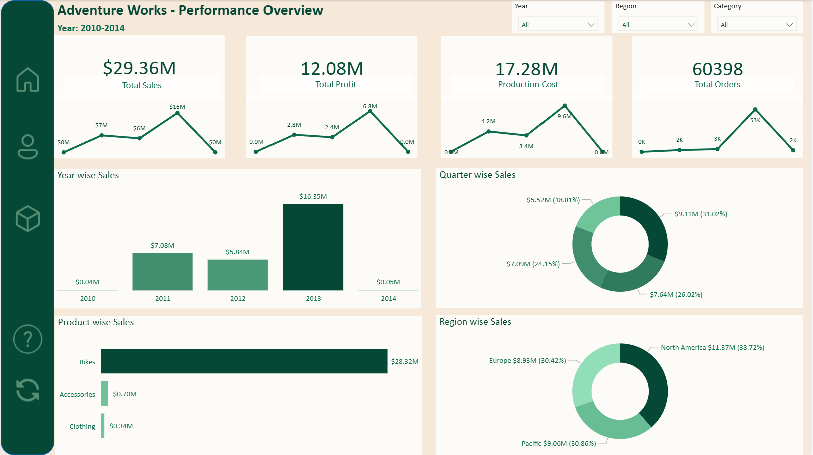
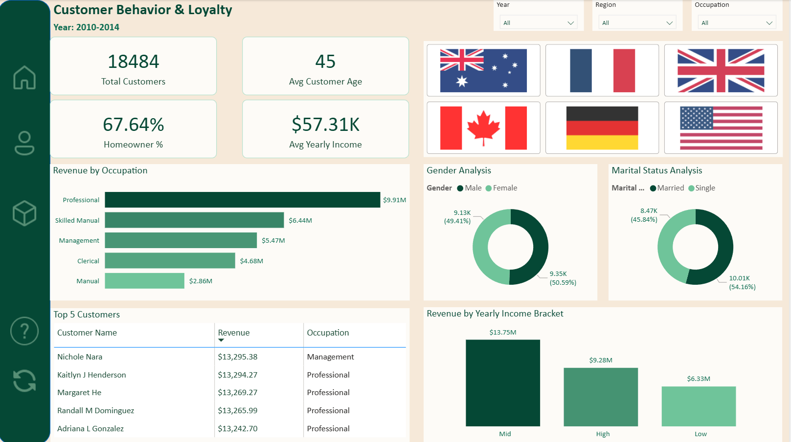
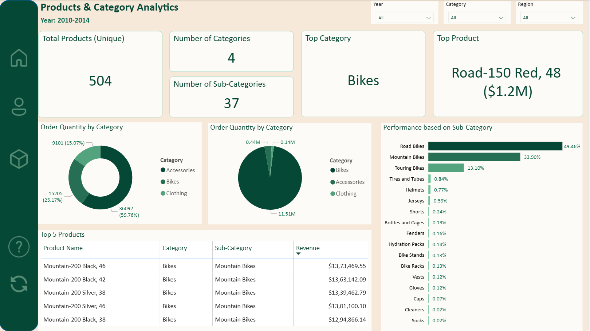
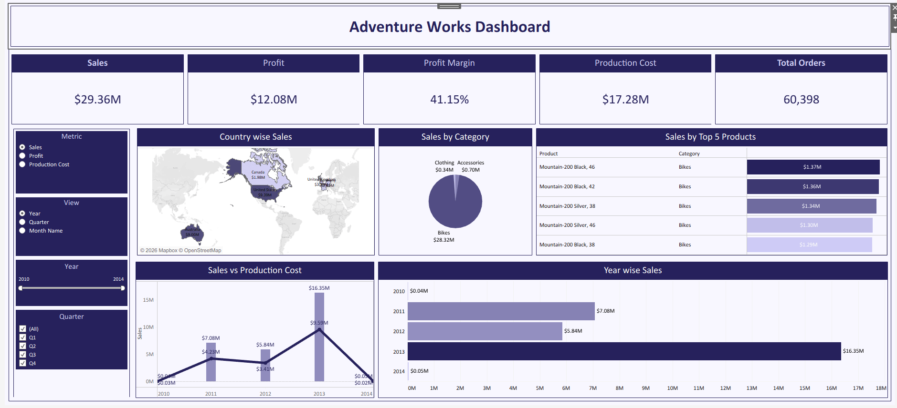
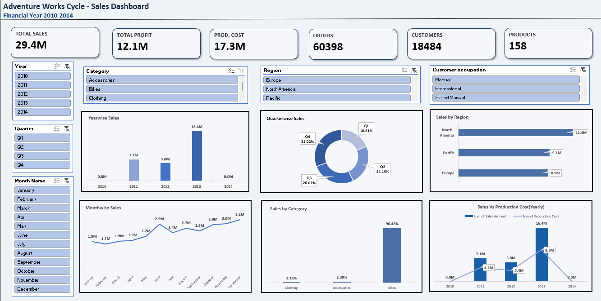

# 📊 AdventureWorks Sales & Business Analytics

---

## 📌 Project Overview

An end-to-end business analytics project built on the **AdventureWorks Cycles** dataset, covering the complete data pipeline — from database creation and SQL analysis to interactive dashboards in Power BI, Tableau, and Excel. The project analyzes internet sales data spanning **Financial Year 2010–2014** across products, regions, customers, and time periods.

---

## 🎯 Business Problem

Adventure Works Cycles needed clear visibility into sales performance across regions, product categories, and time periods to support better business decisions. This project addresses that by building interactive dashboards that give instant visibility into revenue, profit, customer behavior, and product performance.

---

## 🛠️ Tech Stack

| Tool | Purpose |
|------|---------|
| **SQL (MySQL)** | Database design, data cleaning & KPI queries |
| **Power BI** | Multi-page interactive business dashboard |
| **Tableau** | Visual analytics dashboard with geographic map |
| **Excel** | Data exploration & pivot-based dashboard |

---

## 📂 Files in this Repository

| File | Description |
|------|-------------|
| `Project.sql` | Full SQL script — table creation, data quality checks, 11 KPI queries |
| `AW_PowerBI.pbit` | Power BI dashboard template (3-page report) |
| `Project.twbx` | Tableau packaged workbook |
| `AW_Excel_project.xlsx` | Excel dashboard *(32MB — exceeds GitHub limit, available on request)* |

---

## 📈 Business Insights Derived

- Total revenue of **$29.36M** with a healthy **profit margin of 41.15%**
- Sales peaked in **2013 at $16.35M** and dropped significantly in 2014 — signals a business trend worth investigating
- **Bikes account for 96.46%** of total sales — strong category concentration
- **North America** is the highest revenue region, followed closely by Pacific and Europe
- **Q4** is consistently the strongest quarter at 31.02% of annual sales
- Professionals and Skilled Manual workers are the highest revenue-generating customer segments
- **Mid-income bracket customers** generate the most revenue at $13.75M

---

## 📸 Dashboard Previews

### 🟢 Power BI — Performance Overview

### 🟢 Power BI — Customer Behavior & Loyalty

### 🟢 Power BI — Products & Category Analytics

### 🔵 Tableau — Adventure Works Dashboard

### 📗 Excel — Sales Dashboard

---

## 📁 Data Source

**AdventureWorks Dataset** — a widely used sample business database provided for learning and analytics practice. It contains internet sales transactions, customer demographics, product catalog, and sales territory information across multiple years.

---

*Project developed as part of a Data Analytics learning journey.*

---

*Project developed as part of a Data Analytics learning journey.*
